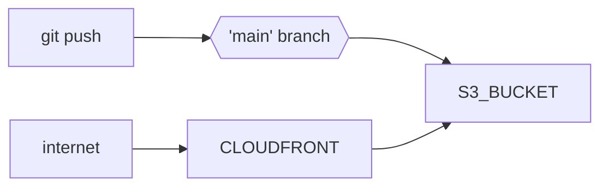

# AWS S3 CloudFront Terraform module

Terraform module which creates S3 bucket (SSE-S3) with CloudFront, Route53 records, ACM and an IAM user to use with CI/CD

## Supported Features

- S3 private bucket with [SS3-S3](https://docs.aws.amazon.com/AmazonS3/latest/userguide/UsingServerSideEncryption.html), **CORS** for the fqdn and a **bucket policy** that denies permissions to upload an object unless the request includes the x-amz-server-side-encryption header to request server-side encryption.

